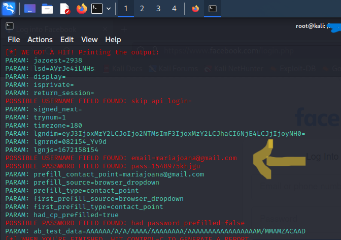

### <h1 align="center">`<> Creating a Phishing on Kali Linux </>` </h1> 

<h2> Digital Innovation One

Intermediate Challenge of CyberSecurity Specialist Training</h2>

<h3> Tools that were used: </h3>


##
<h4> Creating a Phishing </h4>

<p> In this project was created my first Phishing to capture facebook passwords</p>


## Setting Up Phishing on Kali Linux
- Access root: ```sudo su ```
- Starting setoolkit: ``` setoolkit ```
- Type of attack: ``` Social-Engineering Attacks ```
- Attack vector: ``` Web Site Attack Vectors ```
- Attack method: ```Credential Harvester Attack Method ```
- Attack method: ``` Site Cloner ```
- getting the machine address: ``` ifconfig ```
- URL to clone: http://www.facebook.com

### Findings



---