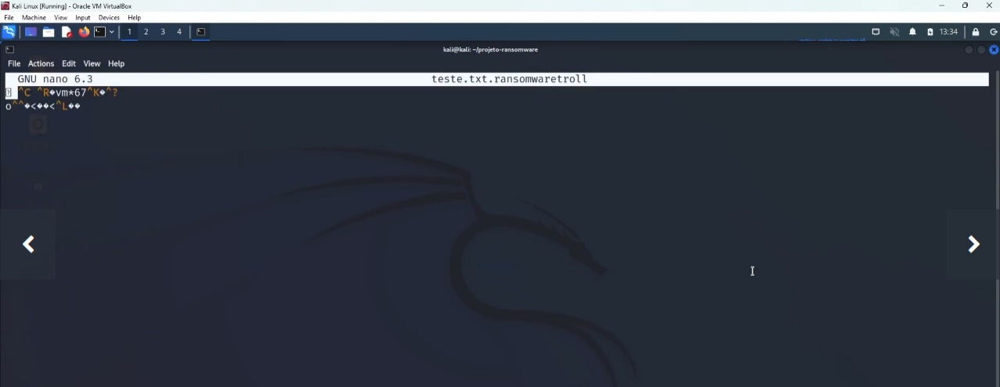

### <h1 align="center">`<> Creating Ransomware in Python  </>` </h1> 

<h2> Digital Innovation One

Advanced Challenge of CyberSecurity Specialist Training</h2>

<h3> Tools that were used: </h3>


##
<h4> Creating Ransomware in Python </h4>

<p> I implemented a Ransomware to encrypt files using the Python language.</p>


## Structure
- Project files: 
- encrypter.py: ``` code that will encrypt the files. ```
- decrupter.py: ``` code that will decrypt a previously encrypted file.```

### Findings



---